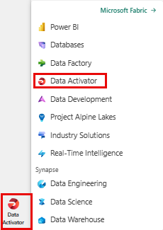
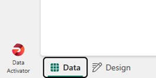

This section guides you through the initial setup process, from activation to understanding its essential elements.

> [!NOTE]
> For the public preview, verify that your organization has workspaces with a Fabric capacity and that Data Activator is available in your region. As a preview feature, Data Activator may not be available in all Azure regions.

## Select the Data Activator experience

To begin using Data Activator in Microsoft Fabric, select ***Data Activator*** from the menu. This option customizes your Fabric experience to Data Activator.

## Create a Reflex

Just like other Fabric experiences, the first thing you do with Data Activator is set up an item in your Fabric Workspace. Data Activator’s items are known as Reflexes. A Reflex item contains all the necessary details to connect to data sources, monitor conditions, and initiate actions. You're likely to set up a Reflex for each business segment or process you're monitoring.

Let's go ahead and create a Reflex item in your Fabric workspace. From the New menu in the workspace, choose the ***Reflex*** item.

## Navigate between data mode and design mode

When you’re working with a Reflex, there are two distinct tabs at the bottom of the screen: *Data* mode and *Design* mode. In data mode, you're able to inspect the fresh data and link it to specific objects. Switch over to design mode to develop triggers based on these objects. Initially, this area will be empty; populating it with your data is your next move after setting up a Reflex.

Next, you'll learn how to connect to data sources, create triggers to monitor conditions and initiate actions.
