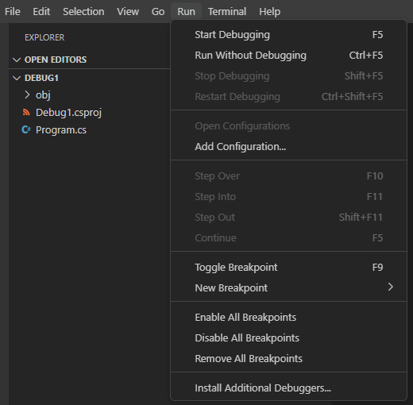
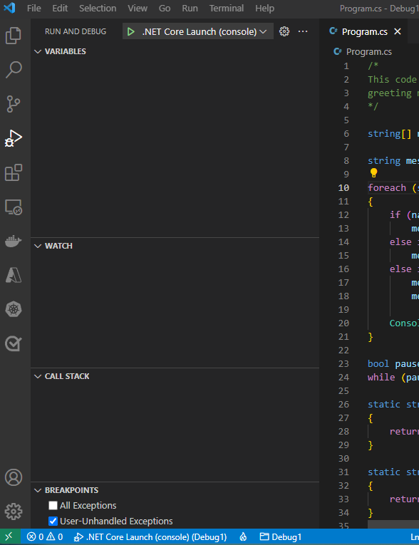

The Visual Studio Code user interface enables developers to run their code in a debug environment. Support for debugging is provided by extensions, and for C# developers, debugger support is provided by the same extension that provides support for code development and IntelliSense.

## Debugger and application interaction

A code debugger can be used to pause and resume code execution, examine variable state, and even change the values assigned to variables at runtime. You may be wondering, how can the debugger control and modify a running application? The short answer is, the debugger has access to the application's runtime environment and executable code.

> [!NOTE]
> Debugger interaction with the runtime environment is an advanced topic. In addition, understanding how the debugger works behind the scenes isn't a requirement for using the debugger. However, the following description of may satisfy your curiosity.

The Visual Studio Code debugger for C# uses the .NET Core runtime to launch and interact with an application. When you start the debugger, it creates a new instance of the runtime and runs the application within that instance. The runtime includes an application programming interface (API), which the debugger uses to attach to the running process (your application).

Once your application is running and the debugger is attached, the debugger communicates with the running process using the .NET Core runtime's debugging APIs and a standard debug protocol. The debugger can interact with the process (the application running within the .NET runtime instance) by setting breakpoints, stepping through code, and inspecting variables. Visual Studio Code's debugger interface enables you to navigate the source code, view call stacks, and evaluate expressions.

The most common way to specify a debug session is a launch configuration in the launch.json file. This approach is the default option enabled by the debugger tools. For example, if you create a C# console application and select **Start Debugging** from the **Run** menu, the debugger uses this approach to launch, attach to, and then interact with your application.

## Create a new code project

The first step in learning the debugger tools is creating a code project that you can run in the debugger.

1. Open a new instance of Visual Studio Code.

1. On the **File** menu, select **Open Folder**.

1. On the **Open Folder** dialog, navigate to your Windows **Desktop** folder.

1. On the **Open Folder** dialog, select **New folder**.

1. Name the new folder **Debug101**, and then select **Select Folder**.

1. On the **Terminal** menu, select **New Terminal**.

    A .NET CLI command can be used to create a new console app.

1. At the TERMINAL panel command prompt, enter the following command:

    ```dotnetcli
    dotnet new console
    ```

1. Close the TERMINAL panel.

## Examine launch configurations for debugging

Visual Studio Code uses a launch configuration file to specify the application that runs in the debug environment.

1. To open the Visual Studio Code **Run** menu, select **Run**.

1. Notice that the **Run** menu provides access to several debug options, including a menu option named **Add Configuration**.

    

    The **Open Configuration** menu option is currently disabled because you have not added a launch configuration file to your project.

1. In the EXPLORER view, select **Program.cs**.

    Your C# code file opens in the Editor.

1. After a few seconds, notice that a dialog box is displayed asking if you want to load the assets that are required for building and debugging.

    

    Visual Studio Code recognizes the C# file extension, `.cs`, and recognizes that your "Debug101" project is missing the required assets.

1. To load the required assets, select **Yes**.

1. Notice the new **.vscode** folder that has been added to your project folder.

    

    > [!NOTE]
    > You could have added the **.vscode** folder to your project from the **Run** menu by selecting **Add Configuration**, and then selecting the option for .NET code projects.

1. In the EXPLORER view, to expand the **.vscode** folder, select **.vscode**.

    Notice that the .vscode folder contains a launch.json file. The launch.json file can be used to configure the debug environment.

1. On the **Run** menu, select **Open Configurations**.

    The launch.json file opens in the Visual Studio Code Editor. You also could have opened the file directly from the EXPLORER view.

1. Take a minute to examine the launch.json file.

    The launch configurations file can include multiple configurations. Each configuration includes a collection of attributes that are used to define that configuration.

1. Notice that the **program** attribute specifies a path to your **Debug101** application.

    Connecting your application with the debugger is one of the primary goals of a configuration. You take a closer look at the launch configuration attributes later in this module.

## Run your code from the Run menu

The **Run** menu in Visual Studio Code provides the option to run your code with or without the debugger.

1. Open the **Program.cs** file.

1. Replace the contents of your Program.cs file with the following code:

    ```csharp
    /* 
    This code uses a names array and corresponding methods to display
    greeting messages
    */
    
    string[] names = new string[] { "Sophia", "Andrew", "AllGreetings" };
    
    string messageText = "";
    
    foreach (string name in names)
    {
        if (name == "Sophia")
            messageText = SophiaMessage();
        else if (name == "Andrew")
            messageText = AndrewMessage();
        else if (name == "AllGreetings")
            messageText = SophiaMessage();
            messageText = messageText + "\n\r" + AndrewMessage();
        
        Console.WriteLine(messageText + "\n\r");
    }
    
    bool pauseCode = true;
    while (pauseCode == true);
    
    static string SophiaMessage()
    {
        return "Hello, my name is Sophia.";
    }
    
    static string AndrewMessage()
    {
        return "Hi, my name is Andrew. Good to meet you.";
    }
    ```

1. On the **File** menu, select **Save**.

1. Open the **Run** menu.

    Notice that the **Run** menu provides options for running your code with or without debugging.

1. On the **Run** menu, select **Run Without Debugging**

1. Notice that the DEBUG CONSOLE panel displays console output, and that the **Debug toolbar** displays execution controls.

    The DEBUG CONSOLE panel should be displayed below the code Editor. By default, the **Debug toolbar** (the small toolbar displaying code execution controls) is located above the code Editor and horizontally centered on the Visual Studio Code window.

1. On the **Debug toolbar**, select **Stop**.

## Start a debug session from the Run menu

The **Run** menu includes the option to start a debug session.

1. On the **Run** menu, select **Start Debugging**

1. Take a minute to review the messages displayed in the DEBUG CONSOLE panel.

    The output from your application is the same as when you ran without debugging, but other messages related to preparing the debug environment are displayed.

1. Notice the messages about loading .NET resources and your Debug101 application.

    The debugger uses a special instance of the .NET runtime to control the execution of your application and evaluate application state.

1. On the **Debug toolbar**, select **Stop**.

## Run your code from the Run and Debug view

The RUN AND DEBUG view in Visual Studio Code supports a rich debugging experience.

1. Switch to the RUN AND DEBUG view.

    

1. In the RUN AND DEBUG view, select **Start Debugging**.

    The **Start Debugging** button is the green arrow on the control panel at the top of the view.

1. Notice that the DEBUG CONSOLE panel shows the same messages about configuring the debugger that were displayed when starting a debug process from the **Run** menu.

1. On the **Debug toolbar**, select **Stop**.

## Examine the output from your application

1. Before closing the DEBUG CONSOLE panel, take a minute to review the output that your code produced.

1. Notice that Andrew's greeting message is repeated.

During the remainder of this module, you use the Visual Studio Code debugger tools to investigate coding issues.

## Recap

Here are a few important things to remember from this unit:

- The Visual Studio Code debugger for C# uses the .NET Core runtime to launch and interact with an application.
- Using the Visual Studio Code **Run** menu to start an application with and without the debugger.
- Using the **Debug toolbar** to **Stop** a running process.
- Using the RUN AND DEBUG view to start debugging an application.
