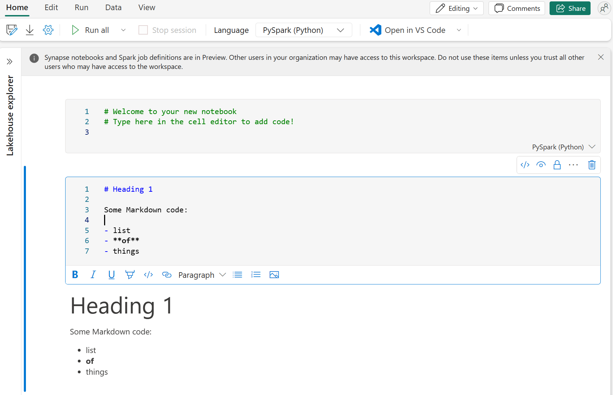

 First, let's discuss what Fabric notebooks offer over the other ingestion options. Unlike manual uploads, notebooks provide automation, ensuring a smooth and systematic approach. Dataflows offer a UI experience; however, they aren't as performant with large semantic models. Pipelines allow you to orchestrate the Copy Data, and might require dataflows or notebooks for transformations. Therefore, notebooks provide a comprehensive, automated solution for ingestion and transformation.

## Explore Fabric notebooks

Fabric notebooks can be easily created in many parts of the Fabric service. Notebooks are stored in the workspace they're created from, which might not be the same workspace where the lakehouse exists.

Similar to other notebooks, Fabric notebooks allow you to have multiple code or Markdown cells. Notebooks are excellent for initial testing, as you can see the code output directly in-line with the code and make quick changes. You can also run individual cells, freeze cells, or run all cells in a notebook.



By default, Fabric notebooks use a Spark engine to allow a multi-threaded, distributed transaction for speedy processes. You can use PySpark, Html, Spark (Scala), Spark SQL, and SparkR (R), depending on your needs.

## Connect to external sources

Now that we know the notebook basics, let's look at connecting to external sources. An excellent ethos in programming is to do the easy way first. Fabric Notebooks offer intuitive [**shortcuts**](/fabric/onelake/onelake-shortcuts) for certain platforms. However, if your data resides elsewhere, you need another method. Here's a basic example of connecting to Azure blob storage with Spark:

```python
# Azure Blob Storage access info
blob_account_name = "<your_blob_account_name>"
blob_container_name = "<your_blob_container_name>"
blob_relative_path = "<your_blob_relative_path>"

# Construct connection path
abfss_path = f'abfss://{blob_container_name}@{blob_account_name}.dfs.core.windows.net/{blob_relative_path}'

# Read data from Azure Blob Storage path into a DataFrame
blob_df = spark.read.parquet(abfss_path)

# Show the DataFrame
blob_df.show()
```

The previous PySpark code defines the parameters and constructs the connection path, then reads the data into a DataFrame and shows the data in the DataFrame.

## Configure alternate authentication

The previous example connects to the source and reads the data into a DataFrame. Depending on your source, you might need a different authentication type, such as Service Principal, OAuth, etc. Here's an example connecting to an Azure SQL Database using Basic authentication:

```Python
# Placeholders for Azure SQL Database connection info
server_name = "<your_server_name>.database.windows.net"
database_name = "<your_database_name>"
table_name = "<YourTableName>"
db_username = "<username>"
db_password = "<password>"

# Build the Azure SQL Database JDBC URL
jdbc_url = f"jdbc:sqlserver://{server_name}:1433;database={database_name};encrypt=true;trustServerCertificate=false;hostNameInCertificate=*.database.windows.net;loginTimeout=30;"

# Properties for the JDBC connection
properties = {
    "user": db_username, 
    "password": db_password,  
    "driver": "com.microsoft.sqlserver.jdbc.SQLServerDriver",
}

# Read entire table from Azure SQL Database using Basic authentication
sql_df = spark.read.jdbc(url=jdbc_url, table=table_name, properties=properties)

# Show the Azure SQL DataFrame
sql_df.show()
```

We successfully connected to external data with Spark and read it into a DataFrame in a Fabric notebook. We discuss how to load the data into a file or table next.
