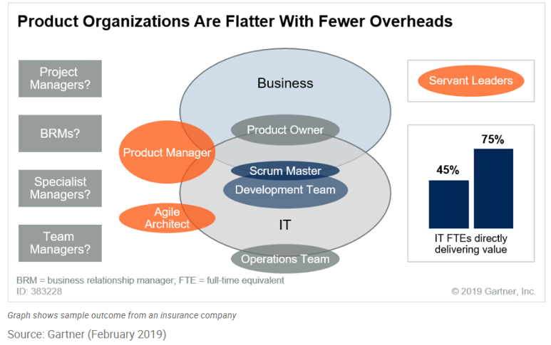

According to Richard Banfield, great product companies have four things in common:

- Speed to market
- Agility when faced with change
- The move to digital business
- Customer satisfaction

### Why adopt a product-centric model?

> By 2024, more than three-quarters of digital business leaders will have benefited from product management practices, up from a third that have already done so in 2018.
> 
> By 2024, 80% of IT organizations will undergo radical restructuring and changes to their missions as they embrace product-centric operating models.
> 
> [Gartner "A Day in the Life of a Digital Product Manager,"](https://www.gartner.com/en/documents/3955809/a-day-in-the-life-of-a-digital-product-manager) Deacon D.K Wan, July 31, 2019 – ID G00400672

> [!div class="centered"]
> ![Diagram depicts product-centric model adoption over time. In total, 85% of the respondents have adopted or plan to adopt a product-centric model. Full adoption over time happens for 54% of the respondents, and partial adoption for 32%. 15% of the respondents say they have fully adopted a product-centric model. 31% expect it to be fully adopted within the next three years. 5% expect to adopt the product-centric model in the next three to five years. 3% expect the adoption process to take longer than five years. 32% of the respondents expect some use of a product-centric model, but not to fully move to one. 15% of the respondents do not have plans to move to a product-centric model. The survey was conducted on 129 Gartner Research Circle members. The question was: What are your organization’s plans for using a product-centric model for software delivery (versus a project-centric model)? Please select one response.](../media/1-4-gartner.png)

Image credit: [Gartner: "Survey Analysis: IT Is Moving Quickly From Projects to Products,"](https://www.gartner.com/document/3891887?ref=lib) Bill Swanton, Matthew Hotel, and Deacon D.K. Wan, October 23, 2018 - ID G00373896

> [!IMPORTANT]
> According to the well-respected author and international public speaker Martin Fowler, "product-mode" is a way of working. It is a way of funding and organizing software development that differs significantly from the projects way of doing it. Although generally applicable to digital-age enterprise IT, this way of working is especially suited to those who aim to drive business through a digital platform.

**Potential benefits of operating in product-mode**

- Ability to reorient quickly 
- Reduced end-to-End cycle time 
- Ability to truly iterate
- Knowledge retention
- Architectural integrity
- Team motivation and dynamics
- Economies of flow and iteration

### What is the product-centric model?

> [!IMPORTANT]
> A business-centric strategy for delivering software and digital experiences in which a product is developed that delivers an ongoing business capability (as opposed to a limited time project-based project). Generally, a product manager owns this product and is responsible for its ongoing development and its budget. This product may exist on a platform, which is essentially a product on which other products are built.
>
> - Definition by Gartner

> [!TIP]
> Projects are used to manage occasional endeavors. 
>
> The product-development process is not an occasional endeavor. It’s a continuous process of improvement of the product through the delivery of new features.
 
A product is not a project because there is no clear definition of what needs to be delivered. A product in the software development industry is any customer-facing system. Because customer needs evolve over time and new technologies are made available, the customer expects that the software they use will evolve as well, hence there’s no clear definition of what needs to be delivered. There's no reason to have a one-year plan for all features to be delivered in a certain sequence if requirements may change every month or even every week. A product development process needs to be adaptable to this change in customer needs.

There’s no clear definition of the date when products need to be delivered. Therefore, products cannot suffer the burden of the project-management process. The product-development process must be much leaner than the traditional project-management process, because delivering new functionalities to a product is always the same project for each new feature: discovery, design, implementation, test, deployment.

> [!IMPORTANT]
> The product-centric model
> - Can serve external and internal customers
> - Is clearly defined by its business capabilities
> - Delivers capabilities that have customers value
> - Can be a repeatable service or a platform
> - Can be bought, sold, subscribed. and/or funded
> - Has competition in the market and a product lifecycle

Aligning a development team to a product requires a fundamental change to the skillsets within the team itself. Instead of deep specialization, the team needs to convert to a full-stack methodology in order to support a product end to end.

Product organizations are flatter with fewer overheads.

> [!div class="centered"]
> 

Image credit: [Gartner “Overcome Objections and Sell the Benefits of Moving From Projects to Products and Agile,”](https://www.gartner.com/document/3901563?ref=solrAll&refval=248377772) Bill Swanton, 12 February 2019, - ID: G00383228
